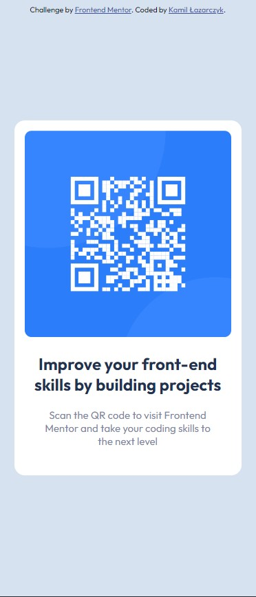

# Frontend Mentor - QR code component solution

This is a solution to the [QR code component challenge on Frontend Mentor](https://www.frontendmentor.io/challenges/qr-code-component-iux_sIO_H). Frontend Mentor challenges help you improve your coding skills by building realistic projects. 

## Table of contents

- [Overview](#overview)
  - [Screenshot](#screenshot)
  - [Links](#links)
- [Built with](#built-with)
- [What I learned](#what-i-learned)
- [Useful resources](#useful-resources)
## Overview

### Screenshot

### Links

- Solution URL: [Add solution URL here](https://your-solution-url.com)
- Live Site URL: [Add live site URL here](https://your-live-site-url.com)

### Built with

- Semantic HTML5 markup
- SCSS
- CSS
- Mobile-first workflow

### What I learned

I used this example to practice using SCSS instead of CSS, and I think that it helped me to get the basics down. Also, this is my first Frontend Mentor project, so I had the opportunity to try out Frontend Mentor.

### Useful resources

- [W3Schools](https://www.w3schools.com/sass/default.php) - Helped me in learning SCSS.
- [Sass](https://sass-lang.com/guide) - Also helped me in learning SCSS.

